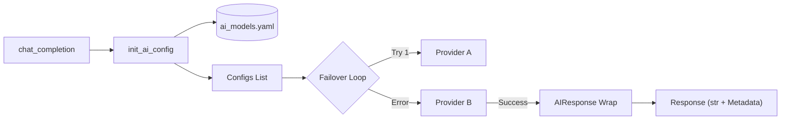

# AI Infra

独立的 AI 基础设施模块，提供统一的 AI 模型接口、多供应商故障转移（Failover）、透明元数据封装以及流式传输支持。

## 核心特性 (Key Features)

- **多供应商故障转移 (Failover)**：基于 YAML 配置，自动在多个提供商之间顺序切换（Sequential Retry），确保业务可靠性。
- **透明元数据封装 (Transparent Metadata)**：
  - `AIResponse`：增强型字符串类，完美兼容普通 `str` 操作（如 `.strip()`, `+`），同时携带 `.model`、`.provider` 和 `.success` 元数据。
  - `AIStream`：异步生成器代理，在流式传输结束后保留模型元数据。
- **配置驱动**：通过根目录下的 `ai_models.yaml` 灵活定义逻辑模型到物理 Provider（如 Azure, OpenAI, Gemini 等）的映射。
- **双层 API 支持**：同时支持崭新的**函数式 API**（`chat_completion`）和**面向对象 API**（`AIInfra` 实例），确保新旧项目平滑过渡。
- **内置安全机制**：包含重试逻辑、异常捕获、 tiktoken Token 统计以及详细执行日志。

## 架构逻辑 (Architecture)



## 使用手册 (Usage Guide)

### 1. 基础调用与元数据提取

```python
from ai_infra import init_ai_config, chat_completion

# 1. 初始化 Failover 配置列表
configs = init_ai_config("gpt-oss")

# 2. 调用（内部自动处理 Failover 和 Metadata 封装）
response = await chat_completion(
    question="如何写一个高效的 Prompt？",
    configs=configs
)

# 3. 像普通字符串一样使用
print(f"Content: {response.strip()}")

# 4. 获取背后的可观测性数据
print(f"Model ID: {response.model}")      # 实际响应的模型名 (e.g., 'gpt-4o')
print(f"Provider: {response.provider}")    # 实际生效的提供商 (e.g., 'AZURE')
print(f"Success: {response.success}")      # 是否成功执行
```

### 2. 流式响应 (Streaming)

```python
configs = init_ai_config("gpt-oss")
stream = await chat_completion(streaming=True, question="讲个故事", configs=configs)

async for chunk in stream:
    print(chunk, end="", flush=True)

# 结束后依然可查元数据
print(f"\nFinal Provider: {stream.provider}")
```

### 3. 命令式与声明式混用 (Legacy Support)

为了兼容旧版 FastAPI 路由，系统完整保留并增强了 `AIInfra` 类：

```python
from ai_infra import AIInfra, ModelConfig

infra = AIInfra()
infra.register_model("gpt-4", ModelConfig(provider="openai", model="gpt-4"))
result = await infra.generate("gpt-4", "Hello")
```

## 配置说明 (`ai_models.yaml`)

 Failover 逻辑由 `providers` 的顺序决定：

```yaml
models:
  gpt-oss:
    providers:
      - provider: AZURE
        model: gpt-4o         # 首选 Azure
      - provider: FREE_SERVER
        model: deepseek-v3    # 备选免费服务器
```

## 环境依赖 (Dependencies)

- `openai >= 1.0.0`
- `google-genai`
- `pyyaml`
- `tiktoken`
- `aiohttp`
- `redis` (可选，用于缓存)
