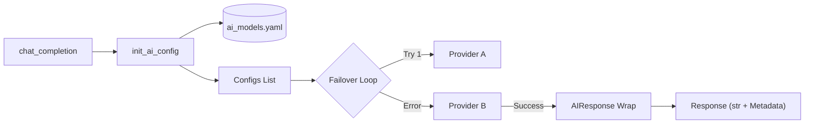

# AI Infra

独立的 AI 基础设施模块，提供统一的 AI 模型接口、多供应商故障转移（Failover）、透明元数据封装以及流式传输支持。

## 核心特性 (Key Features)

- **多供应商故障转移 (Failover)**：基于 YAML 配置，自动在多个提供商之间顺序切换（Sequential Retry），确保业务可靠性。
- **透明元数据封装 (Transparent Metadata)**：
  - `AIResponse`：增强型字符串类，完美兼容普通 `str` 操作（如 `.strip()`, `+`），同时携带 `.model`、`.provider` 和 `.success` 元数据。
  - `AIStream`：异步生成器代理，在流式传输结束后保留模型元数据。
- **配置驱动**：通过同目录下的 `ai_models.yaml` 灵活定义逻辑模型到物理 Provider（如 FREE 中转站、ChatAnywhere、Gemini、DashScope 等）的映射。
- **system prompt 自动降级**：当中转站不接受 `system` role 时，自动把系统指令并入 user 消息重试。
- **内置安全机制**：重试逻辑、异常捕获以及详细执行日志。

## 架构逻辑 (Architecture)


```mermaid
graph LR
    User[chat_completion] --> Resolve[init_ai_config]
    Resolve --> YAML[(ai_models.yaml)]
    Resolve --> Configs[Configs List]
    Configs --> Loop{Failover Loop}
    Loop -->|Try 1| P1[Provider A]
    Loop -->|Error| P2[Provider B]
    P2 -->|Success| Wrapper[AIResponse Wrap]
    Wrapper --> Return["Response (str + Metadata)"]
```

## 使用手册 (Usage Guide)

### 1. 基础调用与元数据提取

```python
from ai_infra import init_ai_config, chat_completion

# 1. 初始化 Failover 配置列表
configs = init_ai_config("deepseek")

# 2. 调用（内部自动处理 Failover 和 Metadata 封装）
response = await chat_completion(
    question="如何写一个高效的 Prompt？",
    configs=configs
)

# 3. 像普通字符串一样使用
print(f"Content: {response.strip()}")

# 4. 获取背后的可观测性数据
print(f"Model ID: {response.model}")      # 实际响应的模型名 (e.g., 'deepseek-ai/deepseek-v4-pro')
print(f"Provider: {response.provider}")    # 实际生效的提供商 (e.g., 'FREE')
print(f"Success: {response.success}")      # 是否成功执行
```

也可以直接传模型名，省去手动取 configs：

```python
response = await chat_completion(question="你好", model_name="qwen")
```

### 2. 流式响应 (Streaming)

```python
configs = init_ai_config("deepseek")
stream = await chat_completion(streaming=True, question="讲个故事", configs=configs)

async for chunk in stream:
    print(chunk, end="", flush=True)

# 结束后依然可查元数据
print(f"\nFinal Provider: {stream.provider}")
```

## 配置说明 (`ai_models.yaml`)

模型解析规则：先精确匹配 key，否则按声明顺序取第一个 `match` 子串命中的条目；Failover 由一个模型下 `providers` 的顺序决定：

```yaml
# 故障转移示例（说明用法）：一个模型可配多个 provider，按顺序尝试，
# 前一个网络/HTTP 出错才切下一个。
models:
  some-model:
    providers:
      - provider: FREE      # 首选
        model: <free-model-id>
      - provider: CHAT      # 备选
        model: <fallback-model-id>
```

> 注：当前实际配置里所有模型都是单 provider。付费的 DASHSCOPE 不做自动兜底，
> 只能通过 `qwen-flash` / `qwen-max` 这两个别名显式调用。

## 环境依赖 (Dependencies)

- `openai >= 1.30, < 2.0`
- `google-genai`
- `pyyaml`
- `python-dotenv`
- `pydantic`
